# CSE-606-SOFTWARE-ENGINEERING
Connecting patients with the right therapists for personalized mental health care.

## Getting Started
1. Clone the repository and change your working directory to the project root.
2. Make sure you have installed Python on your system.
3. Create a virtual environment:
```sh
python3 -m venv venv'
```
4. Activate it:
```sh
source venv/bin/activate
```
5. Install dependencies:
```sh
pip install -r requirements.txt
```
6. Run the web server:
```sh
python main.py
```
7. Open `localhost:8000` in your browser!


## Third Iteration: Final
In this iteration, you will redesign and rebuild your system using microservices and multi-modal clients.

**Client side:** The system has a desktop-based client and a web-based client.

**Server side:** The system has at least two microservices for the core server functions. Each is developed by a team member. For example, a library management system should have at least one service is for book management, one is for user management, and one is for borrowing management. Each microservice communicates using RESTful APIs. The service registry also communicates using RESTful APIs. Each microservice should use an independent database. Simple data objects (e.g., user) are stored in a key-value database like Redis. More complicated data objects (e.g., books with many reviews. multiple authors...) are stored in a document-based database like MongoDB.

### Deconstructing Complexity: The Art of Breaking It Down into Manageable Steps
1. Support for Restful APIs
    - GET all therapists
    - GET search therapists
    - GET a single therapist
    - POST user signup
    - POST user login
    - POST user logout
    - GET user profile
    - POST user profile
    - TODO POST schedule appointment
    - TODO New use case --> review
2. Define micro services
    - Manage Users: Login, Logout, Signup
    - Mange Appointments, Therapists, (Reviews)
3. Implement micro services
4. Support for multiple databases
    - Redis
    - MongoDB
5. Support for desktop client
    - Python Tkinter

### 1 (20 pt). Requirements: Description with UI sketch of all use cases. Use cases should be described with the standard format including a short description and a sequence of user actions and system reactions. Each user action or system reaction might include a UI sketch. You should include all use cases, both from Iterations 1 and 2 and the new ones for Iteration 3. 
TODO

### 2 (10 pt). Database design: Description of data entities and relationships, entity-relationship diagram, sample data.
TODO

### 3 (20 pt). Architectural design: Description of client and server components; communication protocol (including data format), overall diagram of the system architecture.
TODO

### 4 (20 pt). A runnable system. You should personalize and polish the UI to improve its uniqueness and look-and-feel.
TODO

### 5 (20 pt). Video recordings of user acceptance tests. Each recording is for a use case.
TODO

### 6 (10 pt). Manual for installation and usage with information on necessary libraries, frameworks, and running guidelines.
TODO

## Second Iteration: ClientServer
### 1. Requirements: Description with UI sketch of all use cases.
Use cases should be described with the standard format including a short description and a sequence of user actions and system reactions. Each user action or system reaction might include a UI sketch.

In this phase we have the following use cases based on the first iteration. Then, you will see the details and UI sketches for each use case:
- Profile Photo
- Processing Profile Photo
- Therapist Detail View
- Schedule an Appointment

#### Profile Photo
**Description:** A user (patient/therapist) should have a profile photo.

**User Actions:**
- Patients should be able to view therapistss profile photo, and therapists should be able to view patients' profile photo.

**System Actions:**
- If a user does not have a profile photo, the system should consider a default photo as the profile photo.

**UI Sketches:**
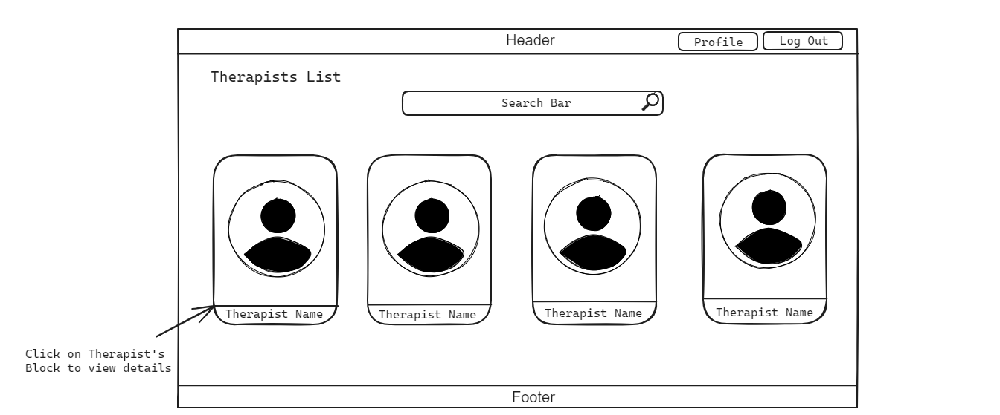

#### Processing Profile Photo
**Description:** A user (patient/therapist) should be able to upload/change/remove his/her profile photo.

**User Actions:**
- Upload a new profile photo (replace).
- Delete the profile photo.

**System Actions:**
- Save user's profile photo on server's disk.
- Update the database for profile photo.

**UI Sketches:**
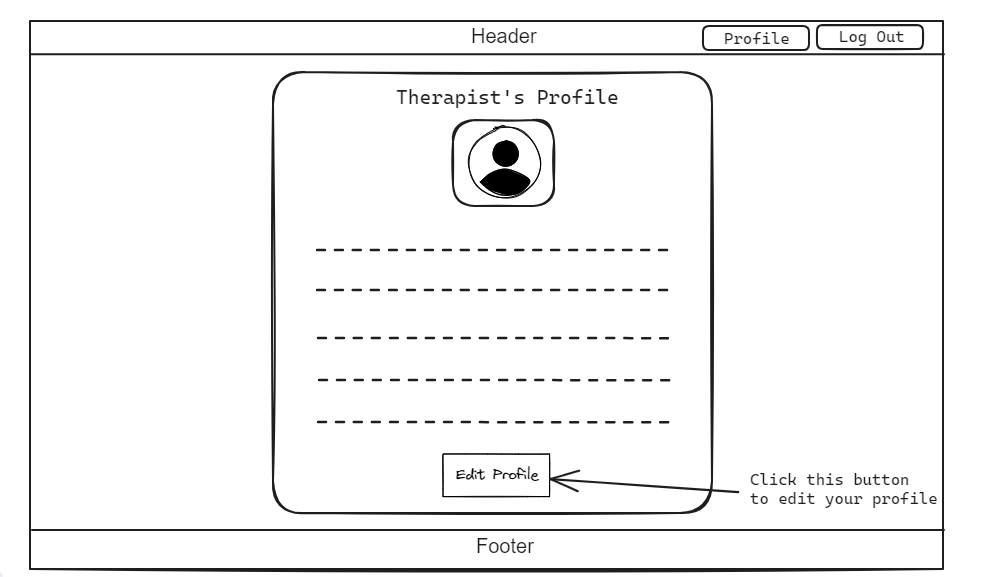

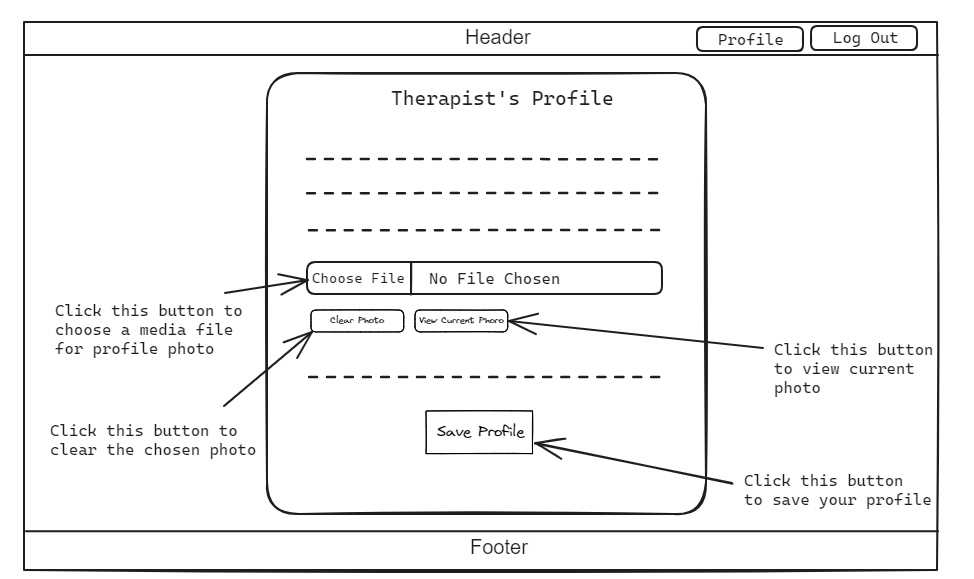

#### Therapist Detail View
**Description:** A patient should be able to view all information related to a therapist (therapist detail view).

**User Actions:**
- A patient should be able to view therapist's details and related information.

**System Actions:**
- Collect the information and data about a specific therapist and process it in a single web page.

**UI Sketches:**
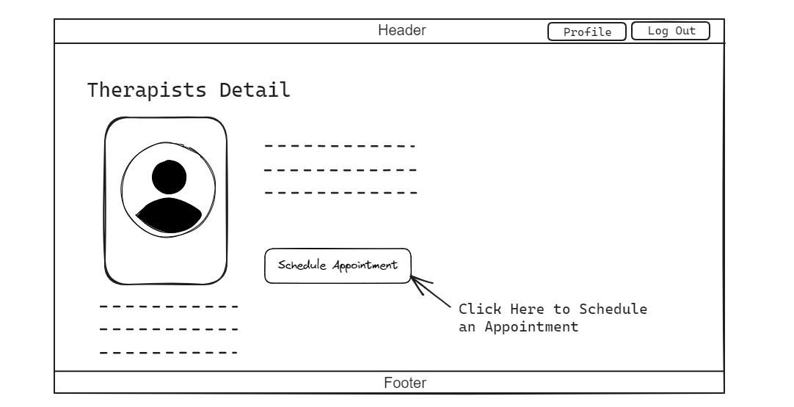

#### Schedule an Appointment
**Description:** A patient should be able to schedule an appointment with a specific therapist.

**User Actions:**
- Schedule an appointment with a specific therapist.
- Select the appointment type (online vs in-persion).
- Fillout the details and notes.

**System Actions:**
- Validate the input data.
- If the input data is validated, store the information in a new table called "appointments".

**UI Sketches:**
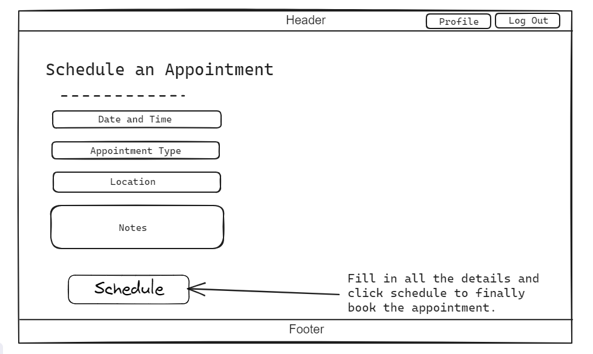

### 2. Database design: Description of data entities and relationships, entity-relationship diagram, SQL code to design database, sample data.

Description of Data Entities and Relationships:

User:

Attributes: name, email, password, is_patient, created_at.

Relationships:
- One-to-One with Profile.
- One-to-Many with Appointments (as patient and therapist).

Profile (Abstract Model):

Attributes: user (Foreign Key), dob, gender, contact_info, photo.

Relationships:
- One-to-One with User.
- Inherited by PatientProfile and TherapistProfile.

PatientProfile (Subclass of Profile):

Additional Attributes: emergency_contact_info, medical_history, insurance_info.

TherapistProfile (Subclass of Profile):

Additional Attributes: office_address, meeting_link, license_info, speciality, experience, bio.

Appointment:

Attributes: patient (Foreign Key), therapist (Foreign Key), appointment_datetime, notes, appointment_type, location, online_link.

Relationships:
- Many-to-One with User (as patient and therapist).

Here is the SQL code to create the tables:
```sql
-- Create the User table
CREATE TABLE User (
    id SERIAL PRIMARY KEY,
    name VARCHAR(255),
    email VARCHAR(255) UNIQUE NOT NULL,
    password VARCHAR(255),
    is_patient BOOLEAN DEFAULT TRUE,
    created_at TIMESTAMP DEFAULT NOW()
);

-- Create the PatientProfile table
CREATE TABLE PatientProfile (
    id SERIAL PRIMARY KEY,
    user_id INT UNIQUE,
    dob DATE,
    gender VARCHAR(10),
    contact_info VARCHAR(255),
    photo VARCHAR(255) DEFAULT '/static/images/profile_default.jpg',
    emergency_contact_info VARCHAR(255),
    medical_history TEXT,
    insurance_info VARCHAR(255),
    FOREIGN KEY (user_id) REFERENCES User(id)
);

-- Create the TherapistProfile table
CREATE TABLE TherapistProfile (
    id SERIAL PRIMARY KEY,
    user_id INT UNIQUE,
    dob DATE,
    gender VARCHAR(10),
    contact_info VARCHAR(255),
    photo VARCHAR(255) DEFAULT '/static/images/profile_default.jpg',
    office_address VARCHAR(255),
    meeting_link VARCHAR(255),
    license_info VARCHAR(255),
    speciality VARCHAR(255),
    experience NUMERIC(3,1),
    bio TEXT,
    FOREIGN KEY (user_id) REFERENCES User(id)
);

-- Create the Appointment table
CREATE TABLE Appointment (
    id SERIAL PRIMARY KEY,
    patient_id INT,
    therapist_id INT,
    appointment_datetime TIMESTAMP,
    notes TEXT,
    appointment_type VARCHAR(10) DEFAULT 'in-person',
    location VARCHAR(255),
    online_link VARCHAR(255),
    FOREIGN KEY (patient_id) REFERENCES User(id),
    FOREIGN KEY (therapist_id) REFERENCES User(id)
);
```

Here is the SQL code to add sample data:
```sql
-- Insert sample data into User table
INSERT INTO User (name, email, password, is_patient) VALUES
    ('John Doe', 'john@example.com', 'hashed_password', TRUE),
    ('Dr. Smith', 'dr.smith@example.com', 'hashed_password', FALSE);

-- Insert sample data into PatientProfile table
INSERT INTO PatientProfile (user_id, dob, gender, contact_info, emergency_contact_info, medical_history, insurance_info) VALUES
    (1, '1990-05-15', 'Male', '123-456-7890', 'Jane Doe (sister) - 987-654-3210', 'Allergies: Penicillin', 'ABC Insurance'),
    (2, '1975-08-20', 'Female', '987-654-3210', 'John Doe (brother) - 555-123-4567', 'No significant history', 'XYZ Insurance');

-- Insert sample data into TherapistProfile table
INSERT INTO TherapistProfile (user_id, dob, gender, contact_info, office_address, meeting_link, license_info, speciality, experience, bio) VALUES
    (2, '1975-08-20', 'Female', '987-654-3210', '123 Main St, Suite 101', 'https://example.com/meeting', 'License #12345', 'Psychologist', 10.5, 'Experienced therapist with a focus on cognitive-behavioral therapy');

-- Insert sample data into Appointment table
INSERT INTO Appointment (patient_id, therapist_id, appointment_datetime, notes, appointment_type, location, online_link) VALUES
    (1, 2, '2023-11-01 14:00:00', 'Initial consultation', 'in-person', 'Office', NULL),
    (1, 2, '2023-11-03 15:30:00', 'Follow-up session', 'online', NULL, 'https://example.com/meeting');
```

The following is ER-Diagram for our database:
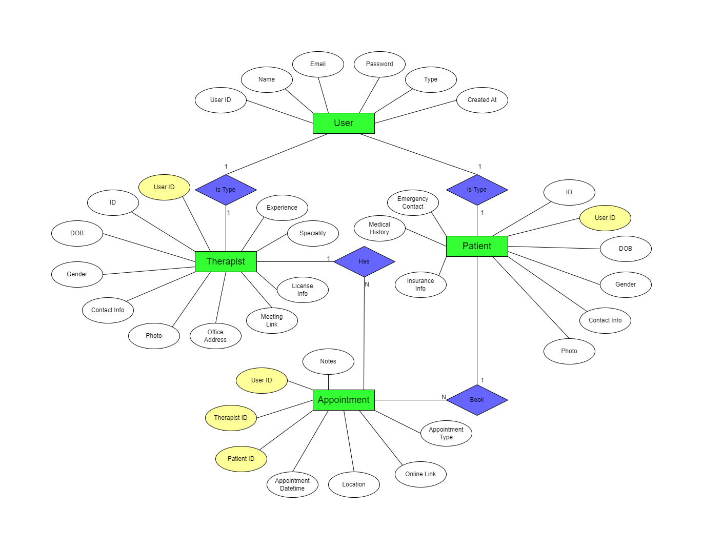


### 3. Architectural design: Description of client and server components; communication protocol (including data format).
We have a web application with both client-side and server-side components. The architectural design of this web application involves the interaction between the client and server components, which communicate using **HTTP** as the underlying communication protocol. Let's break down the components and communication protocols in more detail:

#### Client Components
1. **HTML Templates:** The client-side involves the HTML templates located in the "templates" directory. These templates define the structure and layout of the web pages, including user interfaces for various use cases. Note that it is not pure HTML, it is Jinja2, which makes the template rendering more comfortable and more functional.
2. **CSS and JavaScript:** The "static" directory contains CSS and JavaScript files responsible for styling and interactivity on the client side. This includes Bootstrap CSS and JavaScript, as well as custom JavaScript ("script.js").
3. **User Interfaces:** The client components are responsible for rendering user interfaces based on the HTML templates and applying styles and behavior using CSS and JavaScript.
4. **Profile Photo:** The client allows users to select or capture a profile photo.

#### Server Components:
1. **Controllers:** The "controllers" directory contains Python modules, such as "users.py" and "appointments.py," which handle incoming HTTP requests and interact with the database. These controllers serve as the bridge between the client and the data.

2. **Models:** The "models" directory contains Python modules, like "users.py" and "appointments.py," that define the data models and database schemas. These models interact with the database to store and retrieve data.

3. **Views:** The "views" directory includes Python modules responsible for processing the client's requests, invoking the appropriate controllers, and rendering the HTML templates to construct dynamic web pages.

4. **Database:** The "database.db" SQLite3 file represents the backend database where user and appointment data is stored.

5. **Utilities:** The "utils.py" file contains utility functions that assist in common tasks, such as handling file uploads or other shared functionalities across the application.

#### Communication Protocol and Data Format:
The communication between the client and server components is based on the **HTTP** (Hypertext Transfer Protocol).
The server listens for incoming HTTP requests from the client and processes them using URL routing and the associated controller methods.
Data is typically exchanged in **JSON** format between the client and the server. This includes data for user profiles, appointments, and any other relevant information.
When uploading profile photos, the data is sent in the form of a file attachment using the HTTP POST method, typically encoded as **"multipart/form-data."**
The server processes the data, stores it in the database, and sends an appropriate HTTP response back to the client. This response may include JSON data or dynamically generated HTML pages based on templates.
Overall, this architecture follows the typical **Model-View-Controller (MVC)** pattern, where the models represent the data and database interactions, the views handle the presentation logic, and the controllers mediate between the two while managing the application's core functionality. The communication between the client and server occurs over HTTP, with data exchanged in JSON format and, in the case of file uploads, as file attachments.

### 4. A runnable system with GUI-based or web-based client (frontend) and web-based or socket-based server, including database access if needed.
In the attached zip file, besides this readme file, the code and a pre-filled database is also attached. In order to run the web application, read the "Getting Started" section in the beginning of this file.

Also, you can watch the YouTube video for every usecase in the following section.

### 5. Video recordings of user acceptance tests.

- Profile Photo: [https://youtu.be/6qD3EnfKS-E](https://youtu.be/6qD3EnfKS-E)
- Processing Profile Photo: [https://youtu.be/uR7PMMwCyXA](https://youtu.be/uR7PMMwCyXA)
- Therapist Detail View: [https://youtu.be/iAzGxWweXsE](https://youtu.be/iAzGxWweXsE)
- Schedule an Appointment: [https://youtu.be/3w7-g2FtHoE](https://youtu.be/3w7-g2FtHoE)

## First Iteration: Prototype
### 1. Requirements: Description with UI sketch of main use cases.

#### Main Use Cases
1. A user (patient or therapist) should be able to signup.
2. A user (patient or therapist) should be able to login & logout, i.e. session auth using web cookies.
3. A patient should be able to search among therapists.
4. Users should be able to complete/view/edit their profile.

#### Sketches
*Home Page:*
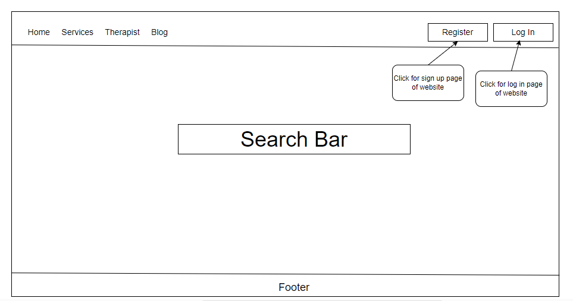

*Login Page:*
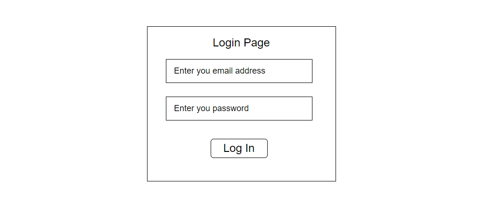

*Signup Page:*
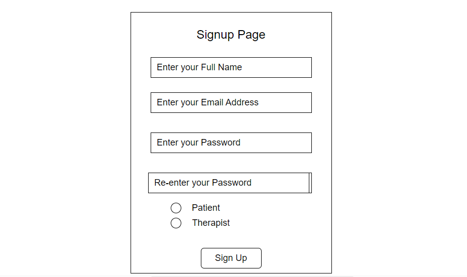

*Therapists:*
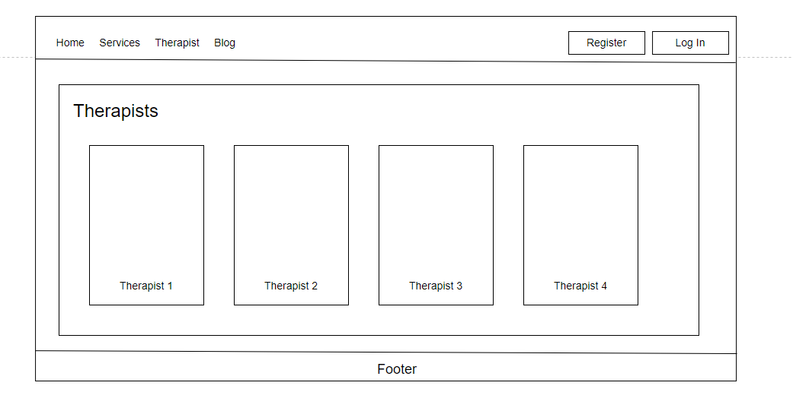

*Patient Profile:*
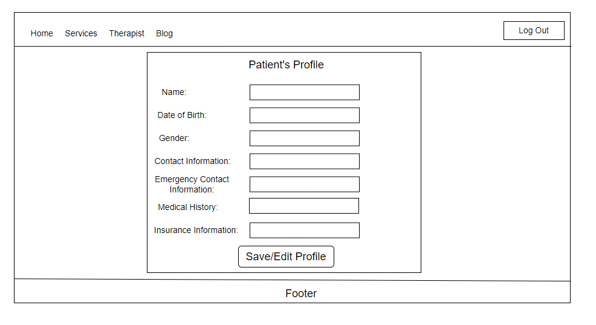

*Therapist Profile:*
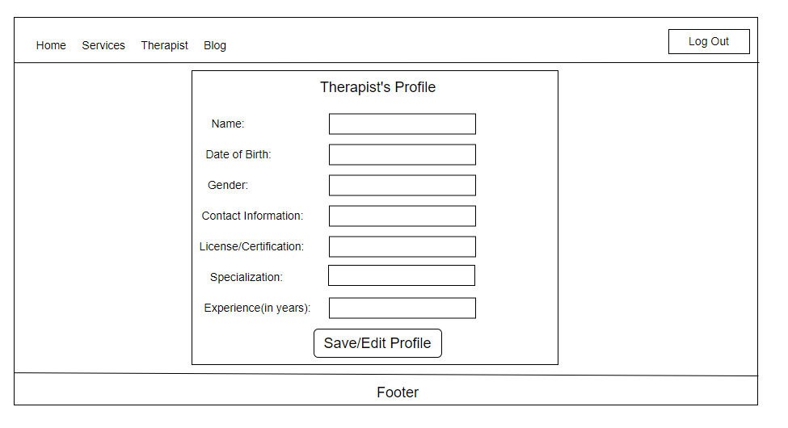

### 2. Database design: Description of data entities and relationships, entity-relationship diagram, SQL code to design database, sample date.

#### Data Entities and Relationships:

User
- Attributes: id (primary key), name, email, password, is_patient, created_at
- Relationships:
One-to-One with Profile (user <-> profile)

Profile (Abstract Class)
- Attributes: id (primary key), user (foreign key), dob, gender, contact_info
- Relationships:
One-to-One with User (profile <-> user)

PatientProfile
- Attributes: id (primary key), emergency_contact_info, medical_history, insurance_info
- Inheritance: Inherits from Profile

TherapistProfile
- Attributes: id (primary key), license_info, speciality, experience, bio
- Inheritance: Inherits from Profile

#### ERD
[frontend/sketches/ER.png](frontend/sketches/ER.png)

#### SQL Code to Create Tables
```sql
CREATE TABLE "user" (
    "id" INTEGER NOT NULL PRIMARY KEY,
    "name" VARCHAR,
    "email" VARCHAR UNIQUE,
    "password" VARCHAR,
    "is_patient" BOOLEAN DEFAULT 1,
    "created_at" DATETIME DEFAULT (DATETIME('now'))
);

CREATE TABLE "patientprofile" (
    "id" INTEGER NOT NULL PRIMARY KEY,
    "user_id" INTEGER UNIQUE,
    "dob" DATE,
    "gender" VARCHAR,
    "contact_info" VARCHAR,
    "emergency_contact_info" VARCHAR,
    "medical_history" VARCHAR,
    "insurance_info" VARCHAR,
    FOREIGN KEY ("user_id") REFERENCES "user" ("id")
);

CREATE TABLE "therapistprofile" (
    "id" INTEGER NOT NULL PRIMARY KEY,
    "user_id" INTEGER UNIQUE,
    "dob" DATE,
    "gender" VARCHAR,
    "contact_info" VARCHAR,
    "license_info" VARCHAR,
    "speciality" VARCHAR,
    "experience" DECIMAL(3, 1),
    "bio" VARCHAR,
    FOREIGN KEY ("user_id") REFERENCES "user" ("id")
);
```

#### SQL Code to Add Sample Data
```sql
-- Sample User Data
INSERT INTO "user" ("name", "email", "password", "is_patient", "created_at")
VALUES
    ('John Doe', 'john@example.com', 'password123', 1, '2023-10-01 08:00:00'),
    ('Dr. Smith', 'dr.smith@example.com', 'securepass', 0, '2023-10-01 09:15:00');

-- Sample PatientProfile Data
INSERT INTO "patientprofile" ("user_id", "dob", "gender", "contact_info", "emergency_contact_info", "medical_history", "insurance_info")
VALUES
    (1, '1990-05-15', 'Male', '123-456-7890', 'Jane Doe - 987-654-3210', 'Allergies: Pollen', 'ABC Insurance Co.');

-- Sample TherapistProfile Data
INSERT INTO "therapistprofile" ("user_id", "dob", "gender", "contact_info",  "license_info", "speciality", "experience", "bio")
VALUES
    (2, '1975-03-20', 'Female', '987-654-3210', 'License #12345', 'Psychologist', 10.5, 'I specialize in cognitive-behavioral therapy.');
```

### 3. Architectural design: Description of 3-tier architecture (e.g., UI, Logic, DB).
In this project, the 3-tier architecture can be described as follows:

**Presentation Tier:** This tier is responsible for handling user interactions and displaying information to the user. In this project, the presentation tier is implemented using HTML, CSS, and JavaScript to create the user interface.

**Application Tier:** This tier is responsible for processing user requests and generating responses. In this project, the application tier is implemented using Pure Python to handle HTTP requests and responses.

**Data Tier:** This tier is responsible for storing and retrieving data. In this project, the data tier is implemented using a SQLite database and PeeWee library to store user and therapist information.

The presentation tier communicates with the application tier using HTTP requests and responses. The application tier communicates with the data tier using SQL queries to retrieve and store data in the database.

This 3-tier architecture provides a separation of concerns between the different layers of the application, making it easier to maintain and scale the application. 

### 4. A runnable prototyping with GUI, database (if needed).
All codes are in this repository. Read the `Getting Started` section in order to run the web app. Also, you can watch the video in the following section.

### 5. Video recordings of user acceptance tests.
YouTube Link: [https://youtu.be/tLZCMh9D0RU](https://youtu.be/tLZCMh9D0RU)

## Project File Structure
```shell
.
├── LICENSE
├── README.md
├── __init__.py
├── controllers
│   ├── __init__.py
│   └── users.py
├── database.db
├── frontend
│   ├── README.md
│   ├── home.html
│   ├── login.html
│   ├── patient_profile.html
│   ├── patient_profile_edit.html
│   ├── sketches
│   │   ├── source_sketches.drawio
│   │   ├── home.PNG
│   │   ├── login.PNG
│   │   ├── profile_patient.PNG
│   │   ├── profile_therapist.PNG
│   │   ├── signup.PNG
│   │   └── therapists.PNG
│   ├── therapist_profile.html
│   ├── therapist_profile_edit.html
│   └── therapists.html
├── main.py
├── mini_web.py
├── models
│   ├── __init__.py
│   └── users.py
├── requirements.txt
├── static
│   ├── css
│   │   └── bootstrap.css
│   ├── images
│   └── js
│       ├── bootstrap.js
│       └── script.js
├── templates
│   ├── about.html
│   ├── base.html
│   ├── footer.html
│   ├── header.html
│   ├── home.html
│   ├── login.html
│   ├── login_success.html
│   ├── profile.html
│   ├── profile_edit.html
│   ├── signup.html
│   ├── thank_you.html
│   └── therapists.html
├── utils.py
└── views
    ├── __init__.py
    ├── index.py
    └── users.py

11 directories, 45 files
```

## TODOs for the next iteration(s)
- [x] Adding profile photos.
- [x] Process multipart/form-data.
- [x] Therapist/Patient detail view
- [x] Adding scheduling system.

Next Phase:
- [ ] Adding review (feedback) system.
- [ ] Better search algorithm using filters.
- [ ] AI recommendation system.
